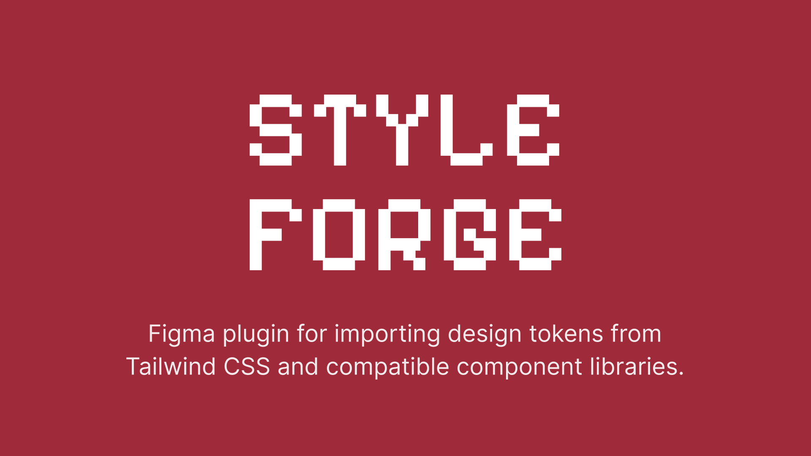

# StyleForge - Figma Plugin



> Import design tokens from popular CSS frameworks and design systems directly into Figma variables and styles.


## What It Does

StyleForge bridges the gap between code and design. It fetches, parses, and imports design tokens from popular CSS frameworks and design systems directly into Figma — no manual data entry, no JSON uploads. One click gives you variable collections with Light/Dark modes, effect styles for shadows, text styles for typography ramps, and web code syntax on every variable.

### Supported Libraries

| Library | Type | What Gets Imported |
|---------|------|-------------------|
| **Tailwind CSS v4** | Primitives | Colors, spacing, radius, shadows, blur, typography matrix (size × weight), breakpoints, containers, font weights, tracking, leading, opacity |
| **Shadcn UI** | Theme (Light/Dark) | Current default theme with **base color + accent pickers** (24 registry themes), semantic tokens aliased to Tailwind primitives, derived radius scale (`sm`–`4xl`), state recipes (`ring/50`, `input/30`, …), shadow tiers, Geist font variables |
| **Base UI** | Theme (Light/Dark) | Semantic and syntax colors for unstyled components |
| **Coss.com** | Theme (Light/Dark) | Semantic colors, info/success/warning status tokens, radius |
| **Radix Colors** | Theme (Light/Dark) | Every scale — 12 steps, solid + alpha variants, with true light/dark pairs (768 tokens) |
| **Material UI** | Theme (Light/Dark) | Default palette, spacing, radius, all 24 elevation shadows as effect styles, typography ramp as text styles |
| **Chakra UI** | Primitives | Color scales, spacing, radii, font sizes/weights, shadows |
| **Mantine** | Primitives | 10-step color scales, spacing, radius, font sizes, shadows |
| **DaisyUI** | Theme (Light/Dark) | Built-in light & dark themes: primary/secondary/accent/base plus radius tokens |
| **Bootstrap 5** | Theme (Light/Dark) | The `--bs-*` palette: brand & gray scales, semantic body/link/border colors |

## Features

- **Direct Import** — select libraries, pick categories, import
- **Live Source of Truth** — Tailwind and shadcn tokens are fetched live from GitHub with bundled snapshots as offline fallback; every import reports whether it used live or bundled data
- **Theme Configuration** — shadcn imports let you pick any registry base color (Neutral, Stone, Zinc, …) and layer an accent theme (Blue, Green, Rose, …) on top
- **Light/Dark Modes** — theme adapters create proper Figma variable modes
- **Free-plan Aware** — on Starter files (one variable mode allowed) the plugin warns you up front and imports Light values instead of failing
- **Smart Aliasing** — theme tokens automatically alias to Tailwind primitive variables when colors match
- **Dependency Resolution** — theme adapters auto-import their primitives first
- **Code Syntax** — every variable gets WEB code syntax (`var(--token)`) so Dev Mode shows the real CSS name
- **Color Conversion** — handles oklch, HSL, RGB, rgba, and HEX to Figma RGBA (CSS Color 4 math)
- **Text Styles** — typography matrices and ramps (Tailwind size × weight, MUI h1–overline)
- **Effect Styles** — grouped shadow tiers, layer blurs, and backdrop blurs
- **Idempotent** — re-running an import updates in place; zero duplicate collections, variables, or styles
- **Tested** — a vitest suite runs every adapter through the real import engine against a mocked Figma API, with CI and a weekly drift check against upstream sources

## Installation

### For Users

[**Install from Figma Community**](https://www.figma.com/community/plugin/1606440312407932342/)

### For Developers

```bash
git clone https://github.com/your-username/styleforge-figma-plugin.git
cd styleforge-figma-plugin
npm install
npm run build
```

Then in Figma:
1. Open the Figma desktop app
2. Go to **Plugins > Development > Import plugin from manifest...**
3. Select the `manifest.json` file from this project

Development watch mode:
```bash
npm run dev
```

Run the test suite:
```bash
npm test
```

## Architecture

```
src/
├── adapters/                   # Library adapters
│   ├── types.ts                # Adapter interface, config & extras types
│   ├── tailwindAdapter.ts      # Tailwind CSS v4 (live fetch, bundled fallback)
│   ├── shadcnAdapter.ts        # Shadcn UI (live registry themes, base+accent merge)
│   ├── baseUiAdapter.ts        # Base UI
│   ├── cossAdapter.ts          # Coss.com
│   ├── radixColorsAdapter.ts   # Radix Colors (solid + alpha scales)
│   ├── muiAdapter.ts           # Material UI (palette, elevations, type ramp)
│   ├── chakraAdapter.ts        # Chakra UI
│   ├── mantineAdapter.ts       # Mantine
│   ├── daisyuiAdapter.ts       # DaisyUI
│   ├── bootstrapAdapter.ts     # Bootstrap 5
│   └── registry.ts             # Adapter registry with dependency resolution
├── core/
│   ├── colorUtils.ts           # oklch/HSL/HEX/RGB → Figma RGBA conversion
│   ├── fetcher.ts              # GitHub raw content fetcher with caching
│   ├── parser.ts               # CSS variable parser & token categorizer
│   ├── jsonTokenParser.ts      # Flat JSON token parser (Light/Dark modes)
│   ├── variableManager.ts      # Figma Variable/Collection management
│   └── figmaSync.ts            # Import orchestration engine
├── data/                       # Bundled token snapshots (with _source stamps)
├── shared/
│   └── messaging.ts            # Typed UI ↔ main thread messages
├── ui/
│   ├── components/             # Dashboard, LibraryCard, ConfigPanel, ImportProgress
│   ├── libraryData.ts          # Library catalog shown in the UI
│   ├── App.tsx                 # Root app with view routing
│   ├── store.ts                # Zustand state management
│   └── styles.css              # Plugin UI stylesheet (light + dark Figma themes)
└── code.ts                     # Figma main thread entry
```

## Adding a New Adapter

1. Create a new file in `src/adapters/` (e.g., `myLibAdapter.ts`)
2. Implement the `LibraryAdapter` interface:

```typescript
import type { LibraryAdapter, ThemeResult, TokenCategory } from './types';
import { parseJsonTokens } from '../core/jsonTokenParser';
import myTokens from '../data/my-lib.tokens.json';

export const myLibAdapter: LibraryAdapter = {
  id: 'mylib',
  name: 'My Library',
  description: 'Description of your library',
  icon: 'mylib',
  repoUrl: 'https://github.com/org/repo',
  type: 'theme',
  dependencies: ['tailwindcss'],
  defaultCollectionName: 'My Lib',
  categories: ['colors'] as TokenCategory[],

  async fetchAndParse(): Promise<ThemeResult> {
    const { light, dark } = parseJsonTokens(myTokens as Record<string, any>);
    return { type: 'theme', tokens: { light, dark } };
  },
};
```

3. Add your token snapshot to `src/data/` (include a `_source` stamp so drift checks know where it came from)
4. Register the adapter in `src/adapters/registry.ts`
5. Add a catalog entry in `src/ui/libraryData.ts` (name, description, categories, optional `configOptions` for select dropdowns)
6. Add golden tests in `src/adapters/adapters.test.ts` and a minimum-variable floor in `src/core/fullPipeline.test.ts`

Adapters can also return `extras` alongside tokens — float variables, string variables (font names), state color recipes, shadow effect styles, and text styles. See `ThemeExtras` in `src/adapters/types.ts`.

## Token Sources

| Library | Source | Format |
|---------|--------|--------|
| Tailwind CSS v4 | Live from `github.com/tailwindlabs/tailwindcss`, bundled fallback | CSS `@theme` block |
| Shadcn UI | Live from `github.com/shadcn-ui/ui` registry themes, bundled fallback (24 themes) | oklch values |
| Base UI | Bundled snapshot | Hex/rgba from Base UI Figma variables |
| Coss.com | Bundled snapshot | Hex/rgba from [coss.com/ui](https://coss.com/ui) design tokens |
| Radix Colors | Extracted from the `@radix-ui/colors` npm package | Hex/rgba, solid + alpha |
| Material UI | Extracted from the `@mui/material` npm package | Hex/rgba + elevation/typography |
| Chakra UI | Extracted from the `@chakra-ui/react` npm package | Hex + scales |
| Mantine | Extracted from the `@mantine/core` npm package | Hex + rem scales |
| DaisyUI | Extracted from the `daisyui` npm package | oklch |
| Bootstrap 5 | Extracted from the `bootstrap` npm package | Hex/rgba |

All bundled snapshots carry a `_source` stamp (package version or commit), and CI re-checks upstream weekly for drift.

## License

MIT - see [LICENSE](LICENSE) for details.

## Contributing

Contributions are welcome. See the adapter pattern above for adding new library support.

1. Fork the repository
2. Create your feature branch (`git checkout -b feat/new-library`)
3. Commit your changes
4. Open a Pull Request
